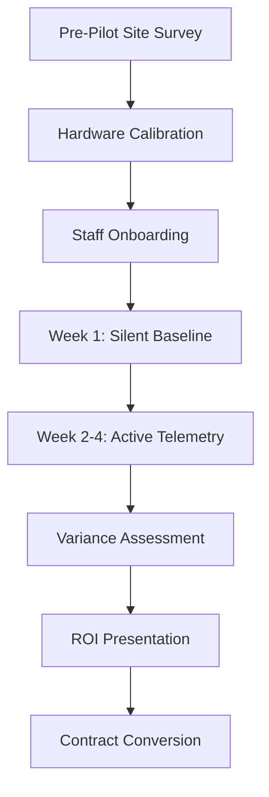

# BRASA Executive Operations Hub

This document serves as the central command layer for coordinating BRASA's enterprise commercial operations, pilot deployments, and executive-level stakeholder communications. It maintains the operational parameters, readiness criteria, and tracking models required to successfully execute pilots across multi-unit hospitality groups.

---

## 1. Active Deployment Priorities

To protect the operational integrity of pilot sites and ensure credible telemetry collection, all target units must satisfy the following core qualification parameters before deployment is initiated:

*   **Protein Asset Density:** Focus on units where high-value proteins (ribs, tenderloin, ribeye, bacon, chicken breast) represent $\ge 60\%$ of the total food cost.
*   **Physical Connectivity:** Receiving docks must demonstrate stable connectivity (via internal Wi-Fi or cellular backup) to support real-time GS1/EAN barcode OCR scanning.
*   **Operational Discipline Scale:** Priority is given to units operating with established prep-sheet guidelines and structured portion-control standards.

### Store Onboarding Profiles
1.  **High-Volume Steakhouses:** Inbound dock weighing (catch-weight verification) + butcher block yields (raw-to-trim portion tracking).
2.  **Central Production Kitchens:** Bulk receiving validation + batch processing yield tracking + outbound internal transfer logs.
3.  **High-Value Casual Dining:** Dock verification (focus on high-cost supplier items like bacon, shrimp, and ribs) + portion-control compliance.

---

## 2. Pilot Readiness Status

The live operational status of hardware, software, and data integration pathways required for upcoming deployments:

### 2.1 Hardware Inventory & Status
*   **Dock Terminals (BRASA Dock-Scan V1):** 12 units calibrated, cellular-enabled, and staged for delivery.
*   **Butcher Yield Scales (BRASA Prep-Scale V2):** 8 scales certified and calibrated against NIST standards.
*   **Barcode Imagers:** 15 handheld rugged scanners tested for optical OCR accuracy in wet dock environments.

### 2.2 Software & Middleware Configurations
*   **Firmware Version:** `2.5.2` (including the scale-lock telemetry client).
*   **OCR Parsing Engine:** Calibrated for multi-format supplier invoice weights.
*   **Offline Queue System:** Enabled to handle temporary connectivity outages during peak dock receiving hours.

### 2.3 POS Data Integration Status
*   **Reconciliation Schema:** Structured for lightweight CSV-based sales export.
*   **IT Footprint:** Standalone data capture; zero local server integrations required during the pilot phase.

---

## 3. Target Enterprise Pipeline

Strategic pilot target groups under active coordination:

| Target Account | Primary Champion | Operational Context | Status |
| :--- | :--- | :--- | :--- |
| **Redbook Hospitality** | Chief Operating Officer (Alberto) | 3 Pilot Units (High-Volume Steakhouses) | Strategic Alignment Phase |
| **Seminole Hard Rock** | VP of Food & Beverage | Multi-outlet casino hospitality units | Context Synchronization |
| **Bloomin' Brands** | Director of Procurement | Regional supply chain receiving audit | Initial Alignment |
| **Fogo de Chão** | VP of Operations | Butcher block yield standardization | Diagnostic Stage |

---

## 4. Commercial Readiness Checklist

A checklist to guide operations teams through pre-pilot, active-pilot, and contract-conversion phases:

### Pre-Pilot Phase
- [ ] Conduct physical site survey of the receiving dock (cellular signal strength, power layout).
- [ ] Verify barcode scan readability on top 5 protein supplier boxes.
- [ ] Calibrate kitchen yield scales with official test weights.
- [ ] Confirm receiving clerk schedule and identify primary dock operators.

### Pilot Execution Phase
- [ ] Deploy and verify "Silent Mode" data ingestion on Day 1 (zero alerts, background telemetry only).
- [ ] Day 8: Activate warning gates, OCR invoice verification, and supervisor override tracking.
- [ ] Day 15: Perform weekly data audit of weight discrepancies and override justifications.
- [ ] Day 22: Validate POS sales reconciliation outputs against protein consumption logs.

### Post-Pilot Conversion Phase
- [ ] Compile the final Executive Variance & Recovery Assessment.
- [ ] Review verified supplier credits (reconciliation savings) with the CFO.
- [ ] Present the operational standardization scorecard to the COO.
- [ ] Propose contract transition path to the per-tracked-pound commercial model.

---

## 5. Meeting Preparation & Communication Scorecard

Before entering any executive-level briefing, the briefing lead must verify the readiness of key operational talking points:

1.  **The "No-Guarantees" Rule:** Never guarantee a specific return on investment (ROI). Instead, state: *"The pilot is structured to identify and quantify current margin exposure."*
2.  **IT Bandwidth Mitigation:** Reassure the executive that the pilot requires zero local IT department queue time: *"We utilize standalone, cellular-connected terminal nodes."*
3.  **Operations Reassurance:** Do not talk about "retraining staff" or "adding work." State: *"We integrate into existing receiving tasks, adding less than 15 seconds per box scan."*
4.  **Supplier Neutrality:** Avoid accusing distributors of fraud. State: *"We provide the independent telemetry necessary to verify billing accuracy at the moment of delivery."*
5.  **Calm Boardroom Demeanor:** Let the data do the talking. Maintain a tone of calm, disciplined, physical operational reality.
