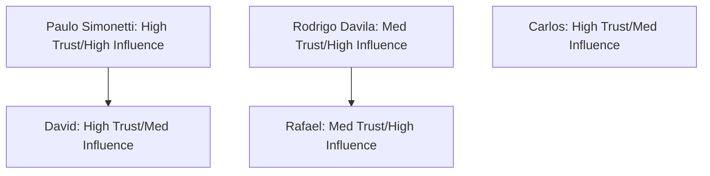

# ENTERPRISE DEAL STRATEGY SYSTEM
## BRASA HQ — Central Strategic Memory Repository
### Phase 3 — Tactical Account Relationship & Conversion Playbook

**Document Version:** 1.0.0  
**Classification:** Enterprise Strategic Commercial Confidential  
**Owner:** Founder & CEO (Alexandre Garcia)  
**Last Reviewed:** 2026-06-01  
**Status:** ACTIVE — EXECUTION STRATEGY  

---

## 1. Active Account Register

The **Active Account Register** tracks the real-time status of our core commercial pipeline. It focuses exclusively on contracted partners and active enterprise sales targets.

### Account Status Register

| Account Name | Target Locations | Current Status | Relationship Strength | Next Action | Prob. Pilot | Prob. Close |
| :--- | :--- | :--- | :---: | :--- | :---: | :---: |
| **Terra Gaucha** | Stamford (ID 4) | Active Pilot (Calibration) | **STRONG** | Present Week 1 baseline yield data to Paulo Simonetti. | 100% | 95% |
| **Hard Rock** | Tampa Casino (ID 9) | Active Pilot (Staged) | **STRONG** | Complete POS Aloha mapping check with David. | 100% | 80% |
| **Texas de Brazil** | Miami, Orlando | Active Prospect | **MODERATE** | Send Stamford baseline case study to Rodrigo Davila. | 85% | 70% |
| **Fogo de Chão** | Dallas, Houston | Active Prospect | **MODERATE** | Schedule initial Dallas meeting with Rafael. | 65% | 50% |

---

## 2. Champion Development Plan

This plan details our approach for developing trust and alignment with our five key target stakeholders:

### 1. Paulo Simonetti (`paulo@terragaucha.com`)
*   **Role:** Managing Partner / Director at Terra Gaucha.
*   **Relationship Level:** Executive Sponsor.
*   **Trust Level:** **HIGH** (Acts as BRASA's primary operational validation champion).
*   **Influence Level:** **HIGH** (Holds absolute purchasing authority for all 6 locations).
*   **Next Step:** Deliver Stamford's Week 1 baseline variance report on Thursday afternoon, showing exact negative supplier drift.

### 2. David (`director@hardrock.brasameat.com`)
*   **Role:** Director of Global F&B Operations at Hard Rock Cafe.
*   **Relationship Level:** Operational Champion.
*   **Trust Level:** **HIGH** (Committed to testing weight verification at Scale).
*   **Influence Level:** **HIGH** (Direct influence on the global F&B procurement board).
*   **Next Step:** Resolve the local Kitchen Manager's login verification issues at Tampa Casino.

### 3. Rodrigo Davila (`rodrigodavila@texasdebrazil.com`)
*   **Role:** Director of Operations at Texas de Brazil.
*   **Relationship Level:** Key Decision Maker.
*   **Trust Level:** **MEDIUM** (Awaiting hard data proving dock receiving does not slow down shipments).
*   **Influence Level:** **HIGH** (Controls the pilot gate for the Miami and Orlando flagships).
*   **Next Step:** Send a 1-page visual brief showing Stamford receiving logs proving scan time is under 15 seconds.

### 4. Rafael (`rafael@fogo.com`)
*   **Role:** Director of Operations at Fogo de Chão.
*   **Relationship Level:** Enterprise Lead.
*   **Trust Level:** **MEDIUM** (Interested in real-time inventory checks; skeptical of ERP compatibility).
*   **Influence Level:** **HIGH** (Authorizes pilots for Texas locations).
*   **Next Step:** Present the standalone CSV import model to bypass Fogo's custom ERP security approvals.

### 5. Carlos (`carlos.am@texasdebrazil.com`)
*   **Role:** Regional Area Manager at Texas de Brazil.
*   **Relationship Level:** Local Operational Influencer.
*   **Trust Level:** **HIGH** (Understands the extent of kitchen yield leakage at the store level).
*   **Influence Level:** **MEDIUM** (Can influence Rodrigo Davila's operational decisions).
*   **Next Step:** Schedule a 15-minute phone call to sync on common GM objections regarding inventory lockouts.

---

## 3. Account-by-Account Strategy

### 3.1 Terra Gaucha (Stamford Flagship)
*   **Best Entry Point:** Direct collaboration with Paulo Simonetti.
*   **Likely Blockers:** Dock Clerks who skip scanning during busy delivery mornings.
*   **Likely Objections:** *"We are a small regional chain; we can manage inventory manually using spreadsheets."*
*   **Ideal Pilot Structure:** 30-day trial at Stamford (ID: 4). Prove immediate cost recovery on high-value steak cuts (Picanha and Filet).
*   **Commercial Strategy:** Value-based pricing model: $450/month per location, showing an ROI of at least 3x.

### 3.2 Texas de Brazil
*   **Best Entry Point:** Rodrigo Davila (Director) and Carlos (Area Manager).
*   **Likely Blockers:** Head Carvers and Butchers who protect their portion cutting templates from audit.
*   **Likely Objections:** *"Scanning will slow down our receiving dock and cause delivery backlogs."*
*   **Ideal Pilot Structure:** 30-day pilot at Miami and Orlando. Establish a silent baseline in Week 1, followed by active alerts in Weeks 2-4.
*   **Commercial Strategy:** Per-store subscription: $650/month. Target 2.5% reduction in unaccounted protein cost.

### 3.3 Fogo de Chão
*   **Best Entry Point:** Regional operations meeting in Dallas with Rafael.
*   **Likely Blockers:** Corporate Purchasing Managers who protect existing supplier agreements.
*   **Likely Objections:** *"Our ERP is proprietary; we cannot integrate external inventory software."*
*   **Ideal Pilot Structure:** 30-day pilot at Dallas Flagship. Use the standalone web console to avoid ERP write-back blocks.
*   **Commercial Strategy:** Enterprise contract: $800/month per store for 70+ units, showing over $120,000 in monthly net profit recovery.

### 3.4 Hard Rock Cafe
*   **Best Entry Point:** David (Global F&B Director).
*   **Likely Blockers:** Local Kitchen Managers who resist Monday 11:00 AM count deadlines.
*   **Likely Objections:** *"We have high staff turnover; training is too difficult."*
*   **Ideal Pilot Structure:** 30-day active pilot at Tampa Casino. Focus on POS Aloha integrations.
*   **Commercial Strategy:** Flat subscription of $750/month per cafe, including onboarding and training support.

---

## 4. Political Risk Map

### Who Can Kill a Deal?
1.  **Store General Managers (GMs):** If GMs complain that the Monday inventory deadlines are too strict, they will convince Area Directors that the software is too complex.
2.  **Enterprise IT Directors:** Security leads can block deployments if they demand custom ERP integrations.
3.  **Supplier Sales Reps:** Suppliers will attempt to convince GMs that weight fluctuations are "normal moisture loss."

### Who Can Accelerate a Deal?
1.  **Paulo Simonetti (Terra Gaucha):** Success at Stamford serves as a live, auditable case study to convince Texas de Brazil.
2.  **VP of Food & Beverage (Texas de Brazil):** Can mandate dock scanning across all 50+ stores in one operational directive.
3.  **David (Hard Rock Cafe):** Can open the gate to the global franchise board.

### Who Must Never Be Surprised?
*   **The Store General Manager:** If a GM is locked out of the inventory system without warning, they will reject the platform.
*   **The Executive Chef:** Chefs protect kitchen autonomy. They must be briefed before the pilot begins to ensure they understand BRASA is an audit tool, not a kitchen critique.

---

## 5. Next 10 Conversations

To drive revenue and close deals over the next 90 days, Alexandre Garcia must prioritize the following conversations:

| Rank | Target Contact | Organization | Topic | Desired Outcome |
| :---: | :--- | :--- | :--- | :--- |
| **1** | Paulo Simonetti | Terra Gaucha | Stamford Week 1 Baseline review | Confirm Stamford's baseline variance and lock in Week 2 active alerts. |
| **2** | David | Hard Rock | Tampa Casino POS Aloha sync | Complete Aloha integration and resolve local manager login issues. |
| **3** | Rodrigo Davila | Texas de Brazil | Stamford pilot data presentation | Secure a verbal agreement for a 30-day pilot at Miami and Orlando. |
| **4** | Carlos | Texas de Brazil | Store-level operational sync | Align on Head Carver training protocols before launching the Miami pilot. |
| **5** | Rafael | Fogo de Chão | Dallas pilot structure | Present the standalone CSV import model and secure a pilot date. |
| **6** | Store GM (Stamford) | Terra Gaucha | Monday inventory compliance check | Ensure the GM completes the inventory count before the 11:00 AM lockout. |
| **7** | David | Hard Rock | Mid-pilot review (Tampa Casino) | Review supplier weight shortages and confirm credit memos. |
| **8** | Rodrigo Davila | Texas de Brazil | Miami/Orlando pilot kickoff | Monitor the first dock scans in Miami and confirm spec alignments. |
| **9** | Fogo de Chão Ops Board | Fogo de Chão | Enterprise case study presentation | Share Stamford and Texas de Brazil ROI data to request a global contract. |
| **10** | Paulo Simonetti | Terra Gaucha | 30-day exit audit & contract | Convert the Stamford pilot into a signed active contract for all 6 stores. |
