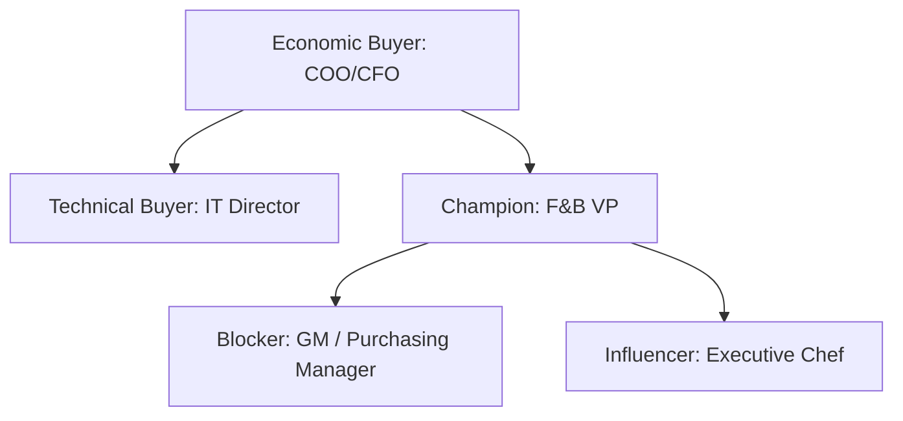

# ENTERPRISE SALES OPERATING SYSTEM
## BRASA HQ — Central Strategic Memory Repository
### Phase 3 — Repeatable Revenue & Scale Framework

**Document Version:** 1.0.0  
**Classification:** Enterprise Commercial Confidential  
**Owner:** Founder & CEO (Alexandre Garcia)  
**Last Reviewed:** 2026-06-01  
**Status:** ACTIVE — COMMERCIAL PLAYBOOK  

---

## 1. Ideal Customer Profile (ICP) & Account Ranking

To convert the platform into a repeatable revenue machine, resources must be focused on target accounts with high margin-recovery potential. The list below prioritizes our target client landscape:

### Account Tiering Matrix

| Tier | Account Name | Store Count | Operational Model | Complexity | Adoption Prob | Est. ARR |
| :---: | :--- | :---: | :--- | :---: | :---: | :---: |
| **Tier 1** | **Fogo de Chão** | 70+ | Rodizio / Steakhouse | High | High | $280,000 |
| **Tier 1** | **Texas de Brazil** | 50+ | Rodizio / Churrascaria | High | High | $200,000 |
| **Tier 2** | **Hard Rock Cafe** | 180+ | A la Carte / Global F&B | High | Medium | $450,000 |
| **Tier 2** | **Bloomin' Brands** | 1,400+ | A la Carte / Multi-unit | Very High | Low-Medium | $3,500,000 |
| **Tier 3** | **Rodizio Grill** | 21 | Rodizio (Franchise) | Moderate | Medium | $75,000 |
| **Tier 3** | **Terra Gaucha** | 6 | Rodizio (Regional) | Moderate | Very High | $25,000 |
| **Tier 3** | **Adega Gaucha** | 2 | Rodizio (Regional) | Moderate | High | $10,000 |

### Tier 1 Profile (High Volume Rodizio)
*   **Texas de Brazil & Fogo de Chão:** High-priority accounts. Their operational model involves high-volume, premium protein consumption (Picanha, Filet, Lamb) with significant cash leakage risk. Success here establishes BRASA as the global industry standard for rodizio inventory tracking.

### Tier 2 Profile (Enterprise Scale & Global Franchise)
*   **Hard Rock & Bloomin' Brands:** High revenue potential but subject to longer sales cycles, security reviews, and corporate hierarchy blocker risks.

### Tier 3 Profile (Regional Validation)
*   **Terra Gaucha & Adega Gaucha:** Lower revenue but serving as essential testbeds to establish pilot case studies and validate software features under active user feedback loops.

---

## 2. Champion Mapping Framework

To navigate political blocks within enterprise restaurant chains, we map key roles for our core pipeline accounts:



### 2.1 Texas de Brazil
*   **Champion:** VP of Food & Beverage. Highly focused on preventing premium protein shrinkage.
*   **Economic Buyer:** CFO. Requires audited proof of cost recovery before approving rollout.
*   **Technical Buyer:** Director of IT. Wants clean integrations with POS (Aloha) and ERP.
*   **Blocker:** Head Carvers. Resistant to logging trim weights on tablets.
*   **Influencers:** Regional Directors who favor real-time inventory reporting.

### 2.2 Fogo de Chão
*   **Champion:** Regional Operations Directors. Favor strict, automated receiving docks.
*   **Economic Buyer:** COO. Focused on network-wide yield improvement.
*   **Technical Buyer:** IT Security Lead. Demands multi-tenant isolation verification.
*   **Blocker:** Corporate Purchasing Managers. Resistant to modifying existing supplier agreements.
*   **Influencers:** Store General Managers wanting accurate inventory projections.

### 2.3 Bloomin' Brands (Outback Steakhouse)
*   **Champion:** F&B Procurement Director.
*   **Economic Buyer:** VP of Supply Chain.
*   **Technical Buyer:** Enterprise Security Architect. Requires full API security reviews.
*   **Blocker:** IT ERP Integration Team. Will block any system requiring database write-backs.
*   **Influencers:** Regional Culinary Managers.

### 2.4 Hard Rock Cafe
*   **Champion:** Director of Global F&B Operations (David).
*   **Economic Buyer:** VP of Finance.
*   **Technical Buyer:** POS Systems Administrator.
*   **Blocker:** Local Kitchen Managers (resistant to strict inventory count deadliness).
*   **Influencers:** General Managers seeking labor efficiency.

---

## 3. Pilot to Contract Conversion System

```
[Pilot Start] ➔ [Pilot Review] ➔ [Pilot Success] ➔ [Executive Review] ➔ [Commercial Proposal] ➔ [Rollout Approval]
```

To prevent pilots from extending indefinitely without generating revenue, we follow a structured conversion process:

### 1. Pilot Start (Day 1)
*   Deploy the physical scanner kit at the dock.
*   Formally agree on the Baseline weight variance during Week 1.

### 2. Pilot Review (Day 15)
*   Review initial weight shortage findings with the store General Manager.
*   Verify that data capture rates exceed **85%**.

### 3. Pilot Success (Day 30)
*   Compile the 30-day savings report (dollars saved + yield percentage improvement).
*   Obtain GM verification of data accuracy.

### 4. Executive Review (Day 35)
*   Present the Stamford case study directly to the economic buyer (CFO/COO).
*   Focus strictly on the financial ROI.

### 5. Commercial Proposal (Day 40)
*   Deliver the rollout proposal for the entire network.
*   Include standard contract terms: a flat monthly subscription fee per store or a value-based fee per pound.

### 6. Rollout Approval (Day 45)
*   Sign the multi-unit agreement and initialize wave 1 store onboarding.

---

## 4. Executive Conversation Framework

### 4.1 Script for the COO (Chief Operating Officer)
> "Every restaurant brand in your portfolio suffers from 2% to 4% unaccounted protein shrinkage. Our system stops this leakage at the receiving dock by verifying every delivery against corporate specs in 15 seconds. We don't change your operations; we secure your margins."

### 4.2 Script for the CEO (Chief Executive Officer)
> "Food cost inflation is compressing your EBITDA. BRASA acts as an automated governance guard across your network. We verify that what you pay suppliers corresponds to what is actually delivered, protecting your brand's bottom line."

### 4.3 Script for the VP of Operations
> "We provide your regional team with real-time compliance dashboards. If a store General Manager fails to submit their weekly inventory, the system locks them out, forcing immediate operational discipline without requiring constant corporate intervention."

### 4.4 Script for the Area Director
> "You manage 10 stores. You cannot stand at every receiving dock. BRASA monitors every delivery for you and flags weight shortages automatically. We help your GMs hit their food cost targets, making your region look excellent."

### 4.5 Script for the General Manager
> "This isn't another corporate chore. BRASA replaces manual paper logs at the dock, reduces inventory count time to 15 minutes, and prevents emergency last-minute ordering by projecting your meat needs automatically."

---

## 5. Objection Escalation Matrix

### Level 1 — Operational Friction
*   **Objection:** *"Barcode scanning will slow down receiving at the dock."*
*   **Response:** *"Our web console parses GS1-128 barcodes in under 15 seconds. It replaces manual clipboard entry, which takes up to 20 minutes."*

### Level 2 — System Integration
*   **Objection:** *"We run a custom ERP. We don't have the IT resources to integrate a new app."*
*   **Response:** *"During the pilot, BRASA operates in standalone mode. We ingest automated POS CSV reports and require zero database write-backs or IT security approvals."*

### Level 3 — Audit & Supplier Resistance
*   **Objection:** *"Our suppliers already weigh every box. We trust their audited shipments."*
*   **Response:** *"Our pilot data shows that even certified vendors exhibit a 0.5% to 1.5% negative weight drift. Over 50 stores, a 1% shortage on beef ribs translates to $80,000 in lost margin annually."*

---

## 6. Account Prioritization Score

To allocate sales time, we score targets from 1 to 5 across five categories:

$$\text{Prioritization Score} = \text{Pain} + \text{Relationship} + \text{Scale} + \text{Tech Readiness} + \text{Exec Access}$$

### Prioritization Parameters:
*   **Operational Pain (1-5):** Current food cost variance (5 = Critical variance, 1 = Optimal).
*   **Relationship Strength (1-5):** Active trust and connection (5 = Signed pilot, 1 = Cold outreach).
*   **Store Count (1-5):** Scale of account (5 = >100 stores, 1 = <5 stores).
*   **Technology Readiness (1-5):** Modern POS/ERP (5 = Cloud POS, 1 = Legacy local DB).
*   **Executive Access (1-5):** Active sponsor connection (5 = COO access, 1 = No contact).

### Pipeline Priorities:
1.  **Terra Gaucha:** Score: $3 + 5 + 2 + 5 + 5 = 20$ (Active Flagship Pilot).
2.  **Texas de Brazil:** Score: $4 + 4 + 4 + 3 + 4 = 19$ (High Priority Prospect).
3.  **Hard Rock:** Score: $3 + 5 + 4 + 3 + 3 = 18$ (Staged Active Pilot).

---

## 7. 90-Day Sales Plan

### Month 1 — Stamford Baseline & Tier 1 Warm-up
*   **Week 1:** Complete setup at Stamford (ID: 4) and verify baseline.
*   **Week 2:** Gather Week 1 Stamford yield shortage metrics.
*   **Week 3:** Share initial Stamford success case study with Texas de Brazil VP of F&B.
*   **Week 4:** Secure pilot agreement for Miami/Orlando locations with Texas de Brazil.

### Month 2 — Pilot Expansion & Tier 2 Security Review
*   **Week 5:** Launch Texas de Brazil pilot.
*   **Week 6:** Submit API security parameters to Hard Rock IT review board.
*   **Week 7:** Compile Week 2 Texas de Brazil yield metrics.
*   **Week 8:** Initiate outreach to Fogo de Chão operations directors.

### Month 3 — Commercial Conversion & Expansion
*   **Week 9:** Deliver Stamford final pilot report. Request contract conversion.
*   **Week 10:** Convert Hard Rock Cafe pilot to active contract.
*   **Week 11:** Deliver Texas de Brazil pilot success presentation to CFO.
*   **Week 12:** Sign Texas de Brazil network rollout contract.

---

## 8. Founder Sales Playbook

### What Alexandre Should Do:
1.  **Sell the ROI:** Focus 100% of executive presentations on **cash recovery** and margin security. Let the product speak for itself during the pilot.
2.  **Leverage Warm Introductions:** Utilize existing hospitality relationships to bypass middle management and schedule meetings directly with COOs/CFOs.
3.  **Audit the Audits:** Treat every pilot meeting as a margin audit review rather than a product demonstration.

### What Alexandre Should Stop Doing:
1.  **Stop Custom Coding for Sales:** Do not write custom features to close a deal. Frame all requests as future roadmap items.
2.  **Stop Pitching Engineering Specifications:** Do not explain the database architecture or BullMQ queuing setup. Executives care about food costs, not Redis connections.
3.  **Stop Managing Lower-level IT disputes:** If a store-level IT lead objects to integration, bypass it by offering standalone CSV mode.

### Time Allocation Guide:
*   **50% of Time:** Direct sales meetings and relationship management with Tier 1 decision-makers.
*   **30% of Time:** Supervising active pilots and audit report generation.
*   **20% of Time:** Product roadmap strategy and high-level team management.
