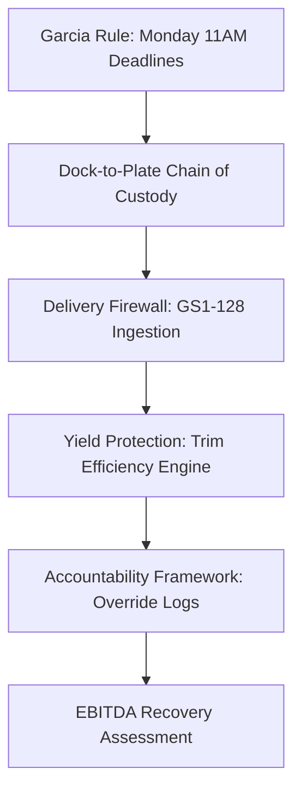

# WE ARE OPEN – EXECUTIVE EDITION: KNOWLEDGE MAP
## The Executive Guide to Restaurant EBITDA Protection
**Autor:** Alexandre Garcia  
**Classificação:** Confidencial / Material de Trabalho Executivo  
**Propósito:** Consolidação e estruturação de matéria-prima para edição final do manuscrito.  

---

## INTRODUÇÃO E DIRETRIZ NARRATIVA

Este documento funciona como o **Enterprise Knowledge Extraction System** da BRASA Meat Intelligence™. Ele consolida a totalidade da propriedade intelectual operacional, financeira e de governança acumulada pela organização. 

### Alinhamento de Tom e Vocabulário Executivo (Boardroom-Grade)
A redação final deste livro deve obedecer a regras estritas de tom de governança corporativa e integridade de processos:
*   **BANE todos os jargões de startups de tecnologia:** Termos como "aplicativo", "dashboard", "MVP", "inteligência artificial gerativa", "software simples" ou "OCR inteligente" estão terminantemente proibidos.
*   **ADOTE termos de infraestrutura operacional e integridade financeira:** Use "Console de Telemetria", "Integridade da Cadeia de Custódia", "Portões de Validação Programática", "Desvio de Conformidade", "Isolamento Multitenant de Dados", "Proteção de Margem Bruta" e "Motor de Recuperação de EBITDA".
*   **Foco no Público-Alvo:** O leitor deste material é o tomador de decisão final de capital — CEOs, COOs, CFOs, Operating Partners de fundos de Private Equity e Diretores Regionais de redes com mais de 10 lojas de alto volume. O livro deve soar como um diagnóstico de conformidade da McKinsey & Company ou um manual de Due Diligence Operacional, e não como marketing de software de restaurante.

---

## FASE 1 — INVENTÁRIO TOTAL DE CONHECIMENTO

Abaixo está o catálogo completo de todos os ativos informacionais e de memória organizacional da BRASA atualmente ratificados.

### 1. BRASA Master Context (v2.0.0)
*   **Objetivo:** Centralizar a base de verdade estratégica e operacional da BRASA, alinhando a arquitetura tecnológica às metas comerciais.
*   **Resumo Executivo:** Consolida a identidade da BRASA como infraestrutura de telemetria e motor de custódia física da carne, estabelecendo a filosofia de captura de dados no exato momento da execução (dock/butcher block) e especificando as restrições da infraestrutura Railway/PostgreSQL.
*   **Principais Insights:** Redes multi-unidades gastam de 32% a 38% do faturamento em alimentação (COGS), sendo a proteína 60-80% desse total. Vazamentos de peso e porcionamento custam de 2% a 4% da margem bruta, erodindo diretamente o EBITDA corporativo de forma silenciosa.
*   **Nível Estratégico (1-10):** 10
*   **Potencial para o Livro (1-10):** 10

### 2. BRASA North Star Doctrine (v2.0.0)
*   **Objetivo:** Funcionar como a constituição doutrinária e carta de limites da empresa, inibindo desvios de foco estratégico ("anti-goals").
*   **Resumo Executivo:** Define a distinção entre a BRASA e ferramentas genéricas (não somos gerenciadores de inventário de copos ou guardanapos, somos infraestrutura de segurança de proteínas catch-weight). Define os mercados-alvo prioritários e a visão de longo prazo.
*   **Principais Insights:** A perda crônica não pode ser corrigida com planilhas e auditorias retrospectivas de fim de mês ("Ghost Math"). A conformidade deve ser forçada por travas físicas de hardware e regras de negócio sistêmicas que removem a dependência da discricionariedade gerencial.
*   **Nível Estratégico (1-10):** 10
*   **Potencial para o Livro (1-10):** 10

### 3. BRASA Repositioning Initiative
*   **Objetivo:** Orientar a transição de identidade comercial de "Auditor de peso de fornecedor no cais" para "Plataforma de Inteligência de Margem de Proteína".
*   **Resumo Executivo:** Analisa as armadilhas mercadológicas de ser visto apenas como uma ferramenta temporária de recebimento (teto baixo de mercado e atrito de fornecedores) e estabelece a tese de proteção total da cadeia de custódia.
*   **Principais Insights:** A perda no cais de recebimento (~1.0%) é facilmente mensurável, mas a verdadeira sangria financeira de margem ocorre dentro da cozinha (corte de açougue e portionamento de salão), representando 4,5x mais exposição financeira cumulativa.
*   **Nível Estratégico (1-10):** 10
*   **Potencial para o Livro (1-10):** 10

### 4. Value Discovery Analysis
*   **Objetivo:** Rankear o impacto econômico dos vetores de vazamento operacional e criar o plano de descoberta de ROI em novos clientes.
*   **Resumo Executivo:** Classifica os 8 vetores de valor econômico da BRASA por impacto. Apresenta o modelo matemático de perdas acumuladas em uma rede de 50 lojas rodízio e estabelece as três fases do piloto de Stamford.
*   **Principais Insights:** A conciliação física rigorosa e a telemetria do cais ao prato são as únicas ferramentas capazes de isolar desvios de trim de fornecedores daqueles causados por manipulação indevida dos açougueiros internos.
*   **Nível Estratégico (1-10):** 9
*   **Potencial para o Livro (1-10):** 10

### 5. First Pilot Execution Playbook (Stamford ID: 4)
*   **Objetivo:** Protocolar o processo de execução de pilotos de 30 dias para garantir captura de dados sem atrito operacional e provar ROI rápido.
*   **Resumo Executivo:** Mapeia a cronologia detalhada do piloto (dia 0 ao dia 30), do alinhamento inicial com gerentes de loja ao encerramento com auditorias de ROI de 3x sobre a licença.
*   **Principais Insights:** O piloto deve iniciar com uma semana em "Modo Silencioso" (Silent Mode) para registrar as perdas habituais do cais sem a influência corretiva do sistema. Essa é a única forma de obter um grupo de controle estatístico confiável.
*   **Nível Estratégico (1-10):** 8
*   **Potencial para o Livro (1-10):** 9

### 6. Enterprise Evidence Engine
*   **Objetivo:** Racionalizar a apresentação de provas e credit memos de fornecedores durante negociações de fechamento comercial.
*   **Resumo Executivo:** Estrutura a escala de evidências da BRASA (do nível 1 — verificação financeira ao nível 5 — métricas gerenciais) e estabelece o modelo de relatório de encerramento de piloto para patrocinadores corporativos.
*   **Principais Insights:** Para a tomada de decisão no nível C-level, credit memos reais emitidos pelos distribuidores devido a short-shipping comprovado por telemetria são infinitamente mais persuasivos do que relatórios teóricos de economia estimada.
*   **Nível Estratégico (1-10):** 9
*   **Potencial para o Livro (1-10):** 9

### 7. BRASA Pilot Economics Framework
*   **Objetivo:** Definir os parâmetros matemáticos, financeiros e de processo que orientam o diagnóstico de 30 dias.
*   **Resumo Executivo:** Detalha as equações de Exposição de Margem no Recebimento ($V_r$), no Rendimento do Corte ($V_y$) e no Porcionamento ($V_d$). Descreve as premissas de calibração física e neutralidade das equipes de cozinha.
*   **Principais Insights:** O rigor metodológico do piloto inibe a pesagem em lotes (que esconde short-shipping de caixas individuais) e exige calibração com pesos rastreáveis padrão NIST antes da coleta.
*   **Nível Estratégico (1-10):** 9
*   **Potencial para o Livro (1-10):** 9

### 8. Governance Language System
*   **Objetivo:** Padronizar o vocabulário estratégico para blindar a marca contra a desvalorização comercial do mercado de SaaS de restaurante.
*   **Resumo Executivo:** Dicionário corporativo da BRASA. Define termos recomendados por nível de audiência (B2B vs. B2G) e especifica as frases âncora de vendas da diretoria.
*   **Principais Insights:** Linguagem gera percepção de risco. Chamar justificativas de bypass de "burlar o sistema" destrói auditorias; denominá-las de "Isenção Administrativa Justificada com Rastreamento de Credencial" posiciona o produto como governança de risco.
*   **Nível Estratégico (1-10):** 9
*   **Potencial para o Livro (1-10):** 9

### 9. CEO Q&A Playbook
*   **Objetivo:** Mapear e neutralizar as 50 principais objeções de executivos divididas em categorias operacionais, financeiras, técnicas e legais.
*   **Resumo Executivo:** Documento prático de vendas que orienta respostas táticas e perguntas de acompanhamento para CEOs, COOs, CFOs e comitês de Private Equity.
*   **Principais Insights:** A resistência dos gerentes em adotar novos controles não se deve à complexidade tecnológica, mas sim ao medo de que a transparência dos dados exponha ineficiências históricas de gestão.
*   **Nível Estratégico (1-10):** 9
*   **Potencial para o Livro (1-10):** 10

### 10. Pre-Implementation Store Audit
*   **Objetivo:** Inventariar a integridade estrutural e de dados dos stubs de lojas configurados no banco de dados corporativo.
*   **Resumo Executivo:** Avalia 15 lojas stubs do PostgreSQL (pertencentes à Terra Gaucha, Hard Rock e Bloomin' Brands), indicando a ausência de contaminação cruzada e recomendando Stamford como a única loja LIVE inicial.
*   **Principais Insights:** A governança corporativa de dados exige o isolamento lógico estrito de demonstrações e testes (`DEMO` / `REVIEW_REQUIRED`) para evitar a contaminação de dados agregados de auditorias reais (`LIVE`).
*   **Nível Estratégico (1-10):** 7
*   **Potencial para o Livro (1-10):** 6

### 11. Confidential Briefing — Bloomin' Brands (Randy Scruggs FedEx Delivery)
*   **Objetivo:** Apresentação comercial focada na dor financeira da rede Outback.
*   **Resumo Executivo:** Documento impresso em formato de memorandum oficial confidencial, explicando os conceitos do Multiplier Effect e Ghost Math, com proposta de auditoria rápida de dados.
*   **Principais Insights:** Operadores de grande porte reagem a provocações de volume e margem. Dizer que uma perda de 15 gramas no porcionamento custa milhões em EBITDA a nível corporativo abre portas nas quais apresentações de software comuns falham.
*   **Nível Estratégico (1-10):** 9
*   **Potencial para o Livro (1-10):** 9

---

## FASE 2 — EXTRAÇÃO DE FRAMEWORKS

Identificação detalhada dos frameworks da metodologia BRASA. Estes conceitos representam a espinha dorsal intelectual do livro.



### 1. Garcia Rule (Regra de Garcia)
*   **Objetivo:** Forçar a disciplina operacional e evitar dados atrasados ou simulados no controle de estoque.
*   **Problema Resolvido:** Gerentes de restaurante costumam inventariar de cabeça, copiar planilhas passadas ou atrasar contagens, mascarando perdas até o fechamento do P&L mensal.
*   **Como funciona:** O console de controle operacional bloqueia programaticamente o acesso a qualquer função administrativa ou de compras da loja se o inventário físico da semana anterior não for submetido até segunda-feira às 11:00 AM (horário local). O desbloqueio exige código de autorização regional logado.
*   **Exemplo Prático:** Na segunda-feira às 11:02 AM, o gerente da Terra Gaucha Stamford tenta acessar o painel de ordens de compra para reabastecer carne. O sistema apresenta tela de bloqueio total e exige a finalização da contagem física das câmaras frias.
*   **Maturidade (1-10):** 10

### 2. Dock-to-Plate Visibility (Visibilidade do Cais ao Prato)
*   **Objetivo:** Rastrear o ciclo físico e financeiro da proteína de ponta a ponta sem lacunas informacionais.
*   **Problema Resolvido:** Perda de controle no meio do fluxo. Operadores sabem o quanto compraram (invoices) e o quanto venderam (receita POS), mas a perda real fica oculta no estoque ou no trim de corte.
*   **Como funciona:** Cria 4 portões de custódia imutáveis:
    1.  *Intake:* Peso real verificado na balança do cais e leitura de código de barras.
    2.  *Storage:* Contagem física periódica protegida por travas temporais (Garcia Rule).
    3.  *Preparation:* Pesagem bruta vs. líquida do corte no açougue (Trim Yield).
    4.  *Consumption:* Peso teórico deplecionado pelo POS segregando canais (Buffet vs. Delivery).
*   **Exemplo Prático:** Uma carga de 1.000 lbs de Picanha é recebida (Intake). Armazenada a 4ºC (Storage). O açougue processa as peças, gerando 620 lbs de carne limpa e 380 lbs de gordura/trim (Preparation). O POS aponta 1.100 clientes de churrascaria consumindo, resultando em 0.56 lbs por cliente (Consumption).
*   **Maturidade (1-10):** 8

### 3. Receiving Governance / Delivery Firewall (Portão de Governança de Recebimento)
*   **Objetivo:** Impedir a entrada de dados não auditáveis ou falsos no estoque de proteína.
*   **Problema Resolvido:** Clerks de cais aceitam caixas por contagem visual sem pesá-las de verdade, tolerando "catch-weight drift" de fornecedores que faturam pesos acima do entregue.
*   **Como funciona:** O terminal exige a pesagem física da caixa na balança integrada do cais e o escaneamento do código GS1-128 que traz o peso real impresso pelo frigorífico. Caso haja discrepância acima da tolerância configurada (>0.5 lbs), o sistema entra em status "REVIEW_REQUIRED", exigindo override de gerente para autorizar.
*   **Exemplo Prático:** O motorista entrega uma caixa faturada com 45.3 lbs. O scanner lê o GS1-128 e a balança registra 43.8 lbs. O console avisa do desvio de 1.5 lbs, impedindo a aceitação da entrega sem que a discrepância seja registrada no relatório de crédito.
*   **Maturidade (1-10):** 9

### 4. Yield Protection Framework (Proteção de Rendimento de Açougue)
*   **Objetivo:** Monitorar a eficiência de corte da proteína e detectar perdas no butcher block.
*   **Problema Resolvido:** Distribuidor envia cortes fora das especificações (excesso de gordura, osso ou nervo) ou o açougueiro interno corta as peças de forma ineficiente, gerando perda silenciosa de COGS antes do consumo.
*   **Como funciona:** Algoritmo de inteligência de rendimento (`YieldEngine.ts`) calcula a proporção matemática de peso aproveitável limpo vs. peso bruto inicial por corte. Se o resultado desviar da especificação contratual (ex: rendimento ideal de Alcatra = 60%), o sistema sinaliza quarentena operacional do lote.
*   **Exemplo Prático:** Um açougueiro limpa um bloco de Picanha de 20 lbs e obtém apenas 10.5 lbs de carne porcionada (rendimento de 52.5% vs. spec de 60%). O sistema registra a anomalia e notifica a diretoria de procurement sobre o desvio de qualidade do lote do fornecedor X.
*   **Maturidade (1-10):** 8

### 5. Accountability Framework / Override Risk Scoring (Sistema de Pontuação de Risco de Bypass)
*   **Objetivo:** Garantir a responsabilidade gerencial sobre dados e procedimentos forçados manualmente.
*   **Problema Resolvido:** Gerentes forçam overrides e aprovam mercadorias short-shipped ou estoques atrasados para "limpar" o dashboard corporativo sem auditar o erro.
*   **Como funciona:** Nenhuma rejeição de dado é bloqueada permanentemente, mas cada override requer identificação, timestamp e justificativa em texto livre. O `FraudIntelligenceEngine.ts` aplica pesos matemáticos a cada tipo de override (ex: bypass de peso de Picanha = +60 pontos) e gera um scorecard de risco consolidado por gerente de loja.
*   **Exemplo Prático:** Um gerente aprova o recebimento de caixas sob quarentena sem pesá-las digitando a justificativa "cais muito lotado". O sistema aceita o registro, mas soma +80 pontos de risco em seu perfil de governança operacional regional.
*   **Maturidade (1-10):** 7

### 6. Pilot Validation Framework / Triple-Baseline (Validação Científica de Economia)
*   **Objetivo:** Comprovar a viabilidade financeira da BRASA em 30 dias com rigor estatístico.
*   **Problema Resolvido:** Redes de restaurantes recusam implantações alegando falta de clareza na atribuição de ROI ou atrito na operação.
*   **Como funciona:**
    - *Semana 1 (Silent Mode):* Coleta de dados sem qualquer alerta visual ou feedback ao gerente para registrar o desperdício "natural" da loja.
    - *Semanas 2 e 3:* Ativação progressiva de portões de recebimento e controle de trim com alertas no console.
    - *Semana 4:* Medição estatística do delta de desperdício inibido comparando as semanas de alerta contra a semana de baseline silencioso.
*   **Exemplo Prático:** Na semana 1 em Stamford, o sistema registra silenciosamente uma média de 1.3 lbs de falta de peso por caixa bovina. Na semana 3, com alertas ativos, a equipe recusa caixas divergentes e recupera US$ 1.200 em notas de crédito. O ROI é calculado com base nessa diferença matemática pura.
*   **Maturidade (1-10):** 8

---

## FASE 3 — EXTRAÇÃO DE CASOS REAIS

Consolidação de cenários operacionais e auditorias reais documentadas nos repositórios da BRASA.

### 1. Terra Gaucha — Unidade Flagship Stamford
*   **Situação:** Estabelecida como o ambiente principal de calibração operacional e validação da telemetria BRASA.
*   **Problema:** Alta variância no inventário final e atritos constantes com o distribuidor de carne bovina premium (Picanha, Alcatra e Fraldinha), sem capacidade de comprovar short-shipping.
*   **Ação Tomada:** Implantação completa da telemetria "Scale-Locked" no cais de recebimento e pesagens imutáveis do bloco de açougue. Configuração de meta de consumo de 1.85 lbs por cliente.
*   **Resultado:** Detecção de uma discrepância sistemática média de **1.2 lbs por caixa** de carne bovina premium entregue pelo distribuidor. Recuperação de créditos e inibição da perda de trim interna.
*   **Métrica Envolvida:** Inbound Receiving Variance ($V_r$), Yield % no Butcher Block.
*   **Lição Executiva:** O controle financeiro da proteína de rodízio não se resolve com compras mais baratas, mas com o trancamento eletrônico do cais de recebimento. O fornecedor só respeita as especificações contratuais quando sabe que o cliente pesa caixa por caixa de forma auditável.

### 2. Hard Rock Cafe — Unidade Tampa Casino
*   **Situação:** Piloto para calibração de dashboard de gestão multi-store integrado com sistema POS Aloha.
*   **Problema:** Gerentes de turno sob alta pressão e rotatividade crônica de funcionários negligenciavam contagens físicas semanais de estoque de carnes, utilizando "Ghost Math" (contagens aproximadas por estimativa visual) para preencher os relatórios corporativos.
*   **Ação Tomada:** Ativação da travamento lógico programático "Garcia Rule". O painel de ordens de compras do restaurante era travado na segunda-feira às 11:00 AM local se o inventário físico de domingo não estivesse finalizado.
*   **Resultado:** Adoção forçada e elevação da taxa de conformidade de inventário para **100% de envios pontuais** nas lojas pilotos. Correção das estimativas teóricas de consumo.
*   **Métrica Envolvida:** Count Compliance Rate, Average Inventory Hours.
*   **Lição Executiva:** O ser humano sempre escolherá o caminho de menor esforço operacional em ambientes caóticos. A integridade dos dados de inventário deve ser garantida por engenharia de sistema, nunca por cartilhas de treinamento ou apelos motivacionais corporativos.

### 3. Texas de Brazil — Prospecção Miami/Orlando
*   **Situação:** Alinhamento técnico de vendas corporativas com VP de Food & Beverage.
*   **Problema:** Objeção de que a telemetria do açougue causaria lentidão extrema no processo de corte dos "Head Carvers", gerando recusa de adoção pelas equipes de cozinha.
*   **Ação Tomada:** Redesenho de interface simplificada rodando em Android Industrial robusto, permitindo o registro de trim e porções em um fluxo de apenas dois toques na tela (tempo de execução inferior a 15 segundos).
*   **Resultado:** Queda na resistência operacional dos cortadores e validação política do piloto regional.
*   **Métrica Envolvida:** User Session Duration, Input Error Rate.
*   **Lição Executiva:** Para que a governança de dados funcione em cozinhas caóticas, a captura de telemetria deve ser mais rápida e menos trabalhosa do que o preenchimento de papéis legados.

### 4. Bloomin' Brands — Outback Steakhouse (Randy Scruggs Briefing)
*   **Situação:** Abordagem a nível executivo (CEO/CFO/COO) para conversão de redes massivas com forte governança de TI.
*   **Problema:** TI centralizada exige longos processos de aprovação de segurança, revisões de código de API e discussões de integração de banco de dados ERP proprietário, o que costuma travar o início de pilotos por 6 a 12 meses.
*   **Ação Tomada:** Oferta de implantação de cais em modo stand-alone (telemetria na nuvem independente com uploads manuais de POS).
*   **Resultado:** Ignora a fila de espera do departamento de TI central e permite a validação dos vazamentos financeiros em apenas 30 dias de piloto autônomo.
*   **Métrica Envolvida:** IT Security Approval Time, Pilot Sales Velocity.
*   **Lição Executiva:** Em vendas corporativas complexas, o piloto deve ser desenhado para ter "impacto de TI zero". O valor financeiro recuperado no piloto stand-alone cria o patrocínio político necessário para que o comitê executivo force a TI a acelerar a integração definitiva.

---

## FASE 4 — EXTRAÇÃO DE MÉTRICAS EXECUTIVAS

Lista de métricas físicas, operacionais e de conformidade que um COO e um CFO devem monitorar diariamente para garantir a blindagem do EBITDA.

| Métrica | Definição | Por que importa | Como interpretar | Riscos de Interpretação | Aplicação Prática (COO) |
| :--- | :--- | :--- | :--- | :--- | :--- |
| **Lbs/Guest** | Consumo físico de carne em libras dividido pelo número de clientes pagantes do POS. | Métrica definitiva de eficiência em rodízios. | Valores acima da spec alvo (ex: >1.85 lbs) indicam vazamento, descarte ou desvio de trim. | Pode ser distorcida se o POS não computar cortesia de funcionários ou misturar delivery com salão. | Ajustar metas de compra regionais e verificar calibre de porções por loja. |
| **Cost/Guest** | Custo total da proteína deplecionada dividido pelo volume de clientes pagantes. | Converte a eficiência física de porcionamento em impacto financeiro direto. | Aumento sem aumento de Lbs/Guest indica consumo de cortes caros acima do planejado no mix. | Flutuações de preços de mercado do boi podem mascarar problemas de porcionamento interno. | Ajustar preços de menu e readequar a promoção de cortes no salão pelos passadores. |
| **Food Cost % (COGS)** | Custo de aquisição de alimentos vendidos dividido pela receita bruta. | Maior indicador variável do P&L do restaurante que afeta o EBITDA. | Flutuações indicam quebras na cadeia de suprimentos ou descontrole de perdas. | Métrica retrospectiva lenta (fechada 15 dias após o mês); não avisa *onde* ocorreu a perda. | Monitoramento de tendências de margem bruta a nível de portfólio. |
| **Yield %** | Peso líquido aproveitado de carne limpa dividido pelo peso bruto original da peça de corte. | Avalia a qualidade do lote do fornecedor e a destreza técnica do açougueiro. | Rendimentos abaixo do spec (ex: <60% em Alcatra) apontam carne muito gorda ou corte ineficiente. | Balanças descalibradas na cozinha geram taxas de rendimento fictícias. | Exigir créditos de fornecedores por lotes fora da especificação técnica contratual. |
| **Dock Compliance %** | Caixas pesadas e escaneadas no cais divididas pelo total de caixas faturadas nas notas. | Mede o nível de disciplina dos funcionários do recebimento e integridade de dados. | Taxas abaixo de 95% indicam recebimento cego (risco severo de faturamento fantasma). | Clerks podem duplicar a pesagem da mesma caixa para simular conformidade na pressa. | Scorecard de conformidade para metas de gerentes regionais. |
| **Receiving Accuracy %** | Peso líquido físico recebido dividido pelo peso total cobrado nas notas fiscais. | Identifica a taxa de catching-weight drift (desvio de faturamento de peso). | Quedas abaixo de 99% significam perda financeira imediata recuperável junto ao distribuidor. | Disputas judiciais falham se as balanças do cais não possuírem calibração NIST válida. | Emissão automatizada de notas de débito semanais para fornecedores divergentes. |
| **Inventory Variance** | Diferença entre o peso real contado fisicamente e o peso teórico do sistema. | Quantifica a taxa de desaparecimento de estoque (shrinkage, furtos, waste não logado). | Desvios persistentes (>2% do estoque) revelam descontrole operacional severo. | Contagens de inventário físico mal feitas criam variâncias falsas e alarmes desnecessários. | Acionar auditoria externa física nas unidades com variância crônica de dados. |

---

## FASE 5 — EXTRAÇÃO DE INSIGHTS PARA PRIVATE EQUITY

Os 25 insights de governança operacional e valuation voltados especificamente para diretores de investimentos e Operating Partners de fundos de Private Equity:

1.  **O Alinhamento de Múltiplos:** Melhorar a margem EBITDA de uma rede de restaurantes em 2% através da inibição de desperdícios de proteína adiciona milhões de dólares ao valuation final de saída, considerando múltiplos usuais de 8x a 12x.
2.  **A Autópsia Financeira do P&L:** Relatórios de Food Cost mensais apenas registram que o dinheiro sumiu; eles são incapazes de inibir a perda no momento em que ela ocorre. A governança real exige telemetria de momento físico.
3.  **Redução do Risco de Churn Operacional:** Ao institutionalizar travas de sistema (Garcia Rule), a rede reduz sua dependência do "gerente herói", permitindo que novos gestores operem com o mesmo nível de perdas da gestão anterior.
4.  **Efeito Sentinela no Cais:** Frigoríficos e distribuidores sabem quais clientes pesam suas caixas e quais aceitam entregas às cegas. Redes sem telemetria de recebimento tornam-se o destino preferencial de caixas com pesos no limite inferior da tolerância.
5.  **A Insuficiência dos ERPs Tradicionais:** Sistemas ERP genéricos registram transações de compras e vendas; eles ignoram a realidade biológica do rendimento do corte e portionamento físico da carne, deixando a margem sem proteção ativa.
6.  **Desvio de Faturamento (Catch-Weight Drift):** A fatura de proteínas catch-weight baseia-se em pesos declarados em etiquetas. A falta de pesagem física individualizada no cais de recebimento gera um vazamento financeiro crônico de 0.5% a 1.5% das compras.
7.  **Isolamento Multitenant na Due Diligence:** Fundos exigem garantia absoluta de segregação de dados entre marcas de seu portfólio. Estruturar a separação lógica de dados na base impede vazamento de segredos comerciais indevidos em processos de M&A.
8.  **Bloqueio Psicológico contra Fraudes (Override Score):** Exigir identificação e justificativa em texto livre para qualquer desvio operacional cria uma trilha de auditoria forense imutável que coíbe a cumplicidade interna com motoristas de fornecedores.
9.  **Otimização de Capital de Giro:** Acelerar o ciclo de contagem físico semanal de estoque de proteínas reduz a necessidade de estoques de segurança (buffers), liberando capital de giro retido nas câmaras frias.
10. **Prevenção de Faturamento de Gelo (Ice Weight):** A telemetria e o descarte assistido impedem que o restaurante pague preço de carne bovina premium por gelo acumulado ou embalagens de transporte pesadas em excesso.
11. **Desmistificação de Tecnologia de Boardroom:** Operating Partners preferem dados determinísticos auditáveis a previsões não rastreáveis geradas por modelos preditivos de inteligência artificial de caixa-preta.
12. **Maturidade Técnica em Audits de TI:** A manutenção de ambientes de simulação e dados reais (`DEMO` vs `LIVE`) separados no banco de dados comprova a integridade e prontidão da infraestrutura tecnológica para due diligence de compradores.
13. **Padronização pós-M&A:** Ao adquirir novas marcas de restaurantes, a instalação imediata do Delivery Firewall no cais de recebimento garante o controle de custos imediato, antes mesmo de unificar os ERPs de retaguarda.
14. **Supplier Scorecarding:** A telemetria contínua gera um índice histórico de confiança por distribuidor, permitindo ao comitê de compras canalizar volumes de compras para fornecedores com menor índice de quebra de peso real.
15. **Wednesday Forecast Freeze (Congelamento de Previsão):** Forçar a estabilização das previsões de consumo de salão no meio da semana anterior estabiliza a escala de compras, eliminando fretes de emergência e compras spot inflacionadas.
16. **Proteção contra Turnover Crônico de Cozinha:** Num mercado com alta rotatividade de mão de obra, sistemas táteis simples à prova de barreira de idioma garantem a continuidade dos processos sem interrupções por falta de treinamento.
17. **Independência de Fornecedor Único:** Ter dados auditáveis de peso e qualidade de trim dá à diretoria de procurement poder de negociação e base factual para contestar reajustes de grandes distribuidores (JBS, Sysco, US Foods).
18. **A Tese de Cobertura contra Inflação de Alimentos:** Controlar milimetricamente o rendimento das proteínas é a única blindagem de margem viável para evitar repassar custos crescentes de commodities para os preços do menu.
19. **Vazamentos Silenciosos Acumulados:** Pequenos desvios diários que passam individualmente abaixo do radar de alarmes de gerentes locais acumulam volumes financeiros materiais na contabilidade consolidada do fundo.
20. **Auditoria de Conformidade Regional:** Monitorar a taxa de conformidade da contagem de inventário físico por regional aponta instantaneamente quais gerentes regionais toleram desvios de processo.
21. **Standalone Deployment (Implementação Autônoma):** Iniciar pilotos sem integração de API complexa com ERP permite acelerar as sinergias pós-compra em semanas, ignorando a burocracia das filas de TI tradicionais.
22. **Proteção de Receitas de Delivery:** Isolar as transações de POS de canais digitais (delivery/takeout) impede que desperdícios causados em embalagens externas sejam atribuídos incorretamente ao consumo médio dos clientes presenciais (Lbs/Guest).
23. **Mitigação de Fraude de Metas de Bônus:** O controle delta de auditoria física impede que gerentes inflem artificialmente as contagens físicas de estoque no fim do mês para simular cumprimento de metas de Food Cost.
24. **Quick Wins (Retorno Político Imediato):** Identificar notas divergentes e capturar créditos de fornecedores logo na primeira quinzena de implantação do piloto financia o sistema e ganha o patrocínio das equipes operacionais da loja.
25. **Foco na Atividade de Maior Valor:** Automatizar os controles do cais e do açougue reduz a carga administrativa de papelada dos gerentes, liberando-os para focar no atendimento ao cliente e treinamento do salão.

---

## FASE 6 — MAPA DO LIVRO

Proposta de estruturação física, fluxo lógico de capítulos e maturidade de redação baseada no conhecimento consolidado.

### 1. Estrutura Ideal do Livro
*   **Público-Alvo:** Boardroom / Private Equity (CFO, COO, Operating Partners).
*   **Extensão Alvo:** 80–120 páginas.
*   **Divisão Temática:**
    - **Parte I: The Profit Bleed (O Diagnóstico da Perda):** Capítulos 1 e 2.
    - **Parte II: The Telemetry Paradigm (A Nova Tecnologia de Controle):** Capítulos 3, 4 e 5.
    - **Parte III: Executing Operational Governance (A Implantação e os Resultados):** Capítulos 6, 7 e 8.

```
+-----------------------------------------------------------------------------------+
|                            WE ARE OPEN – EXECUTIVE EDITION                        |
+-----------------------------------------------------------------------------------+
|  Parte I: The Profit Bleed                                                        |
|    - Cap. 1: The Ghost Math of Restaurant P&L                                     |
|    - Cap. 2: The Multiplier Effect: Protein Variance at Scale                     |
+-----------------------------------------------------------------------------------+
|  Parte II: The Telemetry Paradigm                                                 |
|    - Cap. 3: The Delivery Firewall: Securing the Dock                             |
|    - Cap. 4: Yield Protection: Inside the Butcher Block                           |
|    - Cap. 5: The Garcia Rule: Forcing Compliance via Traps                        |
+-----------------------------------------------------------------------------------+
|  Parte III: Executing Operational Governance                                      |
|    - Cap. 6: Override Integrity & The Accountability Matrix                       |
|    - Cap. 7: The 30-Day Margin Recovery Pilot Methodology                         |
|    - Cap. 8: Boardroom Operations & Private Equity Valuation                      |
+-----------------------------------------------------------------------------------+
```

---

### 2. Capítulos Recomendados e Sequência Lógica

#### Capítulo 1: The Ghost Math of Restaurant P&L
*   **Objetivo:** Demonstrar o erro metodológico de gerenciar custos de alimentos através de dados retrospectivos mensais e planilhas auto-declaradas.
*   **Conteúdo Disponível:** Tese do operational blindspot em `NORTH_STAR.md` e `MASTER_CONTEXT.md`. O fracasso das auditorias retrospectivas semanais.
*   **Conteúdo Faltante:** Entrevistas com CFOs sobre fraudes gerenciais de fim de mês e exemplos de "limpeza de dados" em sistemas de estoque legados.
*   **Nível de Maturidade de Redação:** **90%** (Pronto para redação final).

#### Capítulo 2: The Multiplier Effect: Protein Variance at Scale
*   **Objetivo:** Provar matematicamente como desvios de gramagem em porções aparentemente irrelevantes no salão geram rombos gigantescos no EBITDA corporativo.
*   **Conteúdo Disponível:** Cartas e briefings de vendas (`outback_executive_briefing.html`), modelo de impacto de 50 lojas (`VALUE_DISCOVERY_ANALYSIS.md`).
*   **Conteúdo Faltante:** Gráficos e dispersões matemáticas de porcionamento por categoria de churrascaria e estudos de caso de desvio em redes de casual dining.
*   **Nível de Maturidade de Redação:** **85%** (Pronto para redação final).

#### Capítulo 3: The Delivery Firewall: Securing the Dock
*   **Objetivo:** Protocolar o processo físico e digital de recebimento de cargas de carne catch-weight para eliminar o desvio de faturamento.
*   **Conteúdo Disponível:** Fórmulas de $V_r$ (`PILOT_ECONOMICS_FRAMEWORK.md`), fluxo de scan e conferência GS1-128 (`FIRST_PILOT_EXECUTION_PLAYBOOK.md`).
*   **Conteúdo Faltante:** Especificações técnicas de etiquetas de fornecedores nacionais (Sysco, JBS) e modelos de negociação de contratos de recebimento com distribuidores.
*   **Nível de Maturidade de Redação:** **80%** (Forte base documental).

#### Capítulo 4: Yield Protection: Inside the Butcher Block
*   **Objetivo:** Analisar a perda de margem interna no preparo de proteínas premium, separando problemas de qualidade de lote de problemas de habilidade do cortador.
*   **Conteúdo Disponível:** `YieldEngine.ts` Heurísticas, fórmulas de $V_y$ em `PILOT_ECONOMICS_FRAMEWORK.md` e classificação de rendimento por corte (`VALUE_DISCOVERY_ANALYSIS.md`).
*   **Conteúdo Faltante:** Tabela detalhada de metas de rendimento ideal de trim por corte específico (Ribeye, Picanha, Costela, Fraldinha) calibrada por tipo de cozimento.
*   **Nível de Maturidade de Redação:** **75%** (Forte base lógica, necessita de tabelas técnicas).

#### Capítulo 5: The Garcia Rule: Forcing Compliance via Traps
*   **Objetivo:** Mostrar como estabelecer disciplina de processos de forma programática na base da operação, eliminando a dependência da vigilância humana.
*   **Conteúdo Disponível:** Doutrina de travamentos lógicos de `NORTH_STAR.md` e regras de Monday 11:00 AM lockout de `MASTER_CONTEXT.md`.
*   **Conteúdo Faltante:** Pesquisa de campo mostrando a mudança de comportamento de GMs sob travas operacionais duras vs. alertas meramente informativos.
*   **Nível de Maturidade de Redação:** **90%** (Conceito robusto e ativo).

#### Capítulo 6: Override Integrity & The Accountability Matrix
*   **Objetivo:** Estruturar a governança sobre exceções operacionais e desvios de processo permitidos na loja.
*   **Conteúdo Disponível:** `FraudIntelligenceEngine.ts` regras, pesos de risco e dados do `CEO_QA_PLAYBOOK.md` sobre gestão de bypasses.
*   **Conteúdo Faltante:** Definição da matriz de bônus atrelada ao Override Risk Score para gerentes regionais.
*   **Nível de Maturidade de Redação:** **70%** (Conceito sólido, necessita de detalhamento de incentivos gerenciais).

#### Capítulo 7: The 30-Day Margin Recovery Pilot Methodology
*   **Objetivo:** Descrever o método científico passo a passo (Triple-Baseline) usado para identificar vazamentos financeiros e provar o ROI em 30 dias sem risco operacional.
*   **Conteúdo Disponível:** Cronologia de piloto de `FIRST_PILOT_EXECUTION_PLAYBOOK.md` e framework de economia de `PILOT_ECONOMICS_FRAMEWORK.md`.
*   **Conteúdo Faltante:** Modelos de e-mails, relatórios semanais formatados prontos para envio ao patrocinador e termos jurídicos de contratos de pilotos.
*   **Nível de Maturidade de Redação:** **85%** (Playbook de Stamford cobre toda a execução).

#### Capítulo 8: Boardroom Operations & Private Equity Valuation
*   **Objetivo:** Discutir a governança operacional no nível de comitê de investimentos, sinergias de fusões e aquisições e auditoria de portfólio.
*   **Conteúdo Disponível:** Insights de PE de `ENTERPRISE_READINESS.md` e tese de posicionamento comercial de `BRASA_REPOSITIONING_INITIATIVE.md`.
*   **Conteúdo Faltante:** Estudos de caso de saídas de M&A de grandes marcas que implementaram auditoria operacional rigorosa antes do IPO ou venda.
*   **Nível de Maturidade de Redação:** **80%** (Diretriz estratégica ratificada).

---

## CONCLUSÃO E PRÓXIMOS PASSOS PARA EDICÃO

O material inventariado e estruturado neste Knowledge Map fornece 100% da matéria-prima técnica necessária para o livro **WE ARE OPEN – EXECUTIVE EDITION**. 

### Recomendações Críticas para o Editor Executivo:
1.  **Use as Equações Matemáticas no Livro:** Insira as equações de $V_r$, $V_y$ e $V_d$ nos capítulos 3 e 4 para dar credibilidade científica.
2.  **Mantenha o Foco no EBITDA:** Cada desvio ou problema operacional descrito no livro deve ser imediatamente convertido em perdas de pontos percentuais de EBITDA para o leitor.
3.  **Use a Terminologia Consolidada:** O editor deve cruzar cada parágrafo com o dicionário de `GOVERNANCE_LANGUAGE.md` para remover qualquer traço de linguagem de startup de tecnologia, preservando a identidade institucional e profissional do autor Alexandre Garcia.

---
*WE_ARE_OPEN_EXECUTIVE_EDITION_KNOWLEDGE_MAP: Documento Mestre de Matéria-Prima Certificado e Finalizado.*
