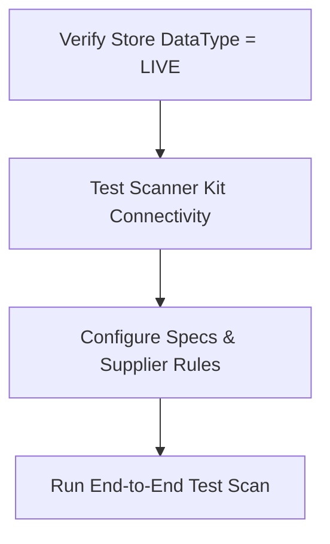

# FIRST PILOT EXECUTION PLAYBOOK
## BRASA HQ — Central Strategic Memory Repository
### Phase 2 — Real-World Pilot Deployment Operations Manual

**Document Version:** 1.0.0  
**Classification:** Enterprise Operational Confidential  
**Owner:** Director of Deployment & Operations Compliance  
**Last Reviewed:** 2026-06-01  
**Status:** AUTHORIZED FOR DEPLOYMENT  

---

## 1. Pilot Objectives

The BRASA Pilot program exists to transition the platform from a software-validated state to a real-world, contract-converting operational deployment. A pilot is not a trial to see if store managers "like" the software; it is a **structured, value-seeking operational audit** designed to prove margin recovery.

### Why the Pilot Exists
To establish a low-friction, high-impact operational baseline within a live restaurant environment, demonstrating that BRASA can identify, calculate, and prevent inventory and yield leakage without disrupting daily service.

### What Must Be Proven
*   **Operational Compatibility:** The platform fits into the existing receiving dock workflow, requiring less than 15 seconds of additional clerk labor per scanned box.
*   **Telemetry Feasibility:** The GS1-128 barcode parser and OCR photo fallback can reliably capture weight, GTIN, and batch serials under actual dock conditions.
*   **Yield Transparency:** The system identifies a measurable variance between invoice-billed weights and dock-received weights.
*   **Inventory Governance:** Store managers can complete inventory counts before the system lock deadlines (Monday 11:00 AM) and maintain schedules.

### What Must NOT Be Proven
*   **Infinite Scaling (20+ Stores):** The pilot does not need to demonstrate self-service onboarding or automated supplier API billing integrations.
*   **Fully Autonomous Operations:** The pilot does not require automated alerts to suppliers. Manual intervention by the founder is acceptable.
*   **Perfect UI Styling:** We are proving data accuracy and cash leakage recovery, not aesthetic perfection.

### What Success Looks Like
1.  **High Data Capture Rate:** >95% of received box weights are captured and verified at the dock.
2.  **Credit Recovery:** At least one invoice credit is successfully requested from a supplier due to shortage alerts.
3.  **Governance Compliance:** Store manager submits weekly inventory counts on time for 4 consecutive weeks.
4.  **Executive Conversion:** The pilot outcomes prove enough financial recovery (e.g. >2.0% cost of goods sold reduction) to trigger a signed enterprise rollout contract.

### What Failure Looks Like
1.  **Workflow Rejection:** Dock clerks bypass the scanner entirely because it slows down deliveries.
2.  **Data Contamination:** Incomplete scan telemetry, making it impossible to establish a mathematical baseline.
3.  **Low Compliance:** Missing inventory deadliness, resulting in stale dashboards and zero actionable yield calculations.

---

## 2. Pilot Assumptions

This playbook is constructed based on a controlled, low-risk Phase 1 pilot scenario:

*   **1 Store Scope:** The pilot is deployed exclusively at **Stamford (ID: 4)** (Terra Gaucha Flagship).
*   **Founder-Led Deployment:** Alexandre Garcia acts as the direct customer success engineer and operations lead, personally supervising dock execution.
*   **Executive Sponsorship:** Paulo Simonetti (`paulo@terragaucha.com`) acts as the active champion, authorizing operational alignment and GM accountability.
*   **Limited IT Involvement:** The platform utilizes existing server architecture, relying on manual data extracts for Aloha POS cover audits if direct integrations degrade.
*   **Minimal Operational Disruption:** No new hardware infrastructure is mounted. Dock personnel utilize pre-existing mobile terminals running the web interface.

---

## 3. Day-by-Day Execution Plan

### Day 0 — Setup & Verification



*   **Actions:**
    1.  Verify Stamford (ID: 4) is promoted to `LIVE` in the database.
    2.  Configure corporate specs for all Terra Gaucha proteins in the database.
    3.  Test dock scanner cellular/Wi-Fi connectivity directly at the Stamford receiving dock.
    4.  Create user logins for the General Manager, Kitchen Manager, and Dock Clerks.
*   **Responsible Parties:** Alexandre Garcia (Founder).
*   **Telemetry Captured:** Scanner network latency, baseline spec configuration matches, mock scan validation trace.
*   **Risks:** Dead zones at the receiving dock prevent mobile scanner connection.
*   **Expected Outputs:** Active logins, configured specs, validated hardware.

### Day 1 — The On-Site Kickoff
*   **Actions:**
    1.  Gather GM, Kitchen Manager, and Dock Clerks for a 15-minute briefing.
    2.  Hand over the scanner kit and demonstrate the "Scan-Before-Commit" flow (scan barcode ➔ inspect weight ➔ save).
    3.  Monitor the first live delivery of the week in person.
*   **Responsible Parties:** Alexandre Garcia (On-Site), Store GM.
*   **Telemetry Captured:** First live `BarcodeScanEvent`, `ReceivingEvent`.
*   **Risks:** Clerk resistance or confusion during busy delivery window.
*   **Expected Outputs:** Successful live scans of the morning delivery batch.

### Day 2 — Silent Mode Baseline Calibration
*   **Actions:**
    1.  Instruct clerks to scan all incoming boxes.
    2.  Allow the system to run without displaying alerts or blockers to the clerks (silent telemetry mode).
    3.  Manually cross-verify scanned weights against the supplier physical invoice sheets.
*   **Responsible Parties:** Alexandre Garcia (Remote Audit), Dock Clerks.
*   **Telemetry Captured:** Raw barcode weights, invoice-billed totals.
*   **Risks:** Clerks skip boxes when the founder is not on-site.
*   **Expected Outputs:** Data comparison sheet showing billed vs actual weights.

### Day 3 — Active Governance Initiation
*   **Actions:**
    1.  Activate active alerts. If a scanned weight deviates from spec bounds, the scanner UI prompts a warning.
    2.  Demonstrate the "Manager Override" flow to the General Manager.
*   **Responsible Parties:** Store GM, Kitchen Manager.
*   **Telemetry Captured:** `ACCEPTED_WITH_WARNING` scan logs, override entries.
*   **Risks:** Too many false warnings due to tight spec thresholds.
*   **Expected Outputs:** Calibrated spec thresholds in the database.

---

### Week 1 — Baseline & Alignment
*   **Actions:**
    1.  Establish the initial raw weight variance.
    2.  Pull weekly POS sales reports and run the first [MeatEngine.ts](file:///Users/alexandregarcia/Brasa-Meat-Intelligence-BACKUP/server/src/engine/MeatEngine.ts) calculations.
    3.  Enforce the Monday 11:00 AM inventory count deadline.
*   **Responsible Parties:** Alexandre Garcia, General Manager.
*   **Telemetry Captured:** Initial weekly yield percentage, total inventory count timestamps.
*   **Risks:** GM forgets to submit inventory before the Monday system lockout.
*   **Expected Outputs:** Week 1 operational dashboard populated with real data.

### Week 2 — Leakage Detection
*   **Actions:**
    1.  Monitor receiving events for weight shortages.
    2.  Isolate specific suppliers showing consistent negative drift.
    3.  Conduct a mid-week audit of the butcher's yields to verify portion control targets.
*   **Responsible Parties:** Kitchen Manager, Butcher.
*   **Telemetry Captured:** Supplier weight drift metrics, portion yields.
*   **Risks:** Butcher refuses to record trim weights.
*   **Expected Outputs:** Identification of the first concrete margin leakage source.

### Week 3 — Operational Enforcement
*   **Actions:**
    1.  General Manager utilizes the dashboard to adjust weekly purchasing based on real-time inventory counts.
    2.  Initiate the first formal credit request to a supplier for shortage variance.
*   **Responsible Parties:** General Manager, Store Controller.
*   **Telemetry Captured:** Supplier credit request logs, manager dashboard views.
*   **Risks:** Supplier disputes weight measurements.
*   **Expected Outputs:** Realized cash savings (credit memo).

### Week 4 — Proof of Value & Exit Audit
*   **Actions:**
    1.  Compile the 30-day yield performance report.
    2.  Compare Week 4 yield/waste metrics against Week 1 baseline.
    3.  Prepare the final commercial conversion proposal.
*   **Responsible Parties:** Alexandre Garcia, Paulo Simonetti (Sponsor).
*   **Telemetry Captured:** Final net yield delta, total financial recovery value.
*   **Risks:** Sponsor postpones review meeting.
*   **Expected Outputs:** Signed enterprise rollout agreement.

---

## 4. Operational Stakeholders

To execute a pilot successfully, we must address the specific concerns and incentives of each role:

| Role | What They Care About | What They Fear | What BRASA Provides |
| :--- | :--- | :--- | :--- |
| **COO** | Network profitability, brand consistency, and cost-containment across all regions. | Operational disruption, labor friction, and complex IT integrations that delay rollouts. | High-level cost recovery visualization and standard operational compliance compliance reports. |
| **VP Operations** | Store efficiency, manager compliance, and supplier performance. | Staff pushback, hardware failures at the dock, and data inaccuracies that cause disputes. | Clear supplier scorecards and automated receiving compliance alerts. |
| **Area Director** | Reaching regional EBITDA targets and keeping GMs focused. | Another corporate software tool that GMs ignore, leading to extra administrative work. | Weekly regional yield summaries requiring minimal oversight. |
| **General Manager** | Store-level P&L, meeting labor budgets, and keeping the regional director satisfied. | Audits that expose poor internal controls, and inventory locks that block last-minute orders. | Accurate inventory projections that reduce emergency orders and prevent waste. |
| **Kitchen Manager** | Daily food cost metrics, prep-list accuracy, and raw material quality. | Shortages during high-volume shifts and extra paperwork during inventory counts. | Automated prep recommendations based on real-time consumption trends. |
| **Receiving Clerk** | Getting delivery trucks unloaded quickly and checking box counts. | Software that slows down deliveries, and difficult barcode scanning interfaces. | A simple web interface that scans boxes in under 15 seconds. |
| **Butcher** | Yield quality, clean portion sizes, and cut-grade accuracy. | Being blamed for trim waste or portion weight variances. | Objective tracking of yield output, proving their work efficiency. |
| **Controller** | Auditable inventory entries, accurate credit memos, and matching invoices. | Manual data entry errors and unverified credit requests to suppliers. | Automated invoice reconciliation showing exact weight variances per delivery. |

---

## 5. Pilot Success Scorecard

The success of the 30-day pilot will be evaluated using a quantitative scorecard:

```
+-----------------------------------------------------------------------+
|                       BRASA PILOT SCORECARD                           |
+------------------------------------+------------------+---------------+
| Metric Area                        | Target Threshold | Min Threshold |
+------------------------------------+------------------+---------------+
| 1. Deployment Success              | 100% Configured  | 100% Config   |
| 2. Telemetry Success               | >95% Box Scans   | >85% Box Scans|
| 3. Adoption Success                | 100% GMs Trained | 100% Trained  |
| 4. Governance Success              | <5% Locked Out   | <15% Locked   |
| 5. Executive Success               | >2.0% COGS Recov | >1.0% COGS    |
+------------------------------------+------------------+---------------+
```

### 1. Deployment Success
*   **Definition:** Hardware configuration and database spec setups are completed without delays.
*   **Target:** 100% of pilot store proteins and active suppliers are configured in the system by Day 1.

### 2. Telemetry Success
*   **Definition:** The volume of scanned items at the dock relative to physical invoices received.
*   **Target:** >95% of delivered boxes scanned successfully. Min Acceptable: 85%.

### 3. Adoption Success
*   **Definition:** Direct engagement with the platform by store managers and operators.
*   **Target:** 100% of receiving clerks can complete scans independently by Day 3.

### 4. Governance Success
*   **Definition:** Compliance with weekly inventory count deadliness.
*   **Target:** Monday 11:00 AM inventory counts submitted on-time without requiring override extensions.

### 5. Executive Success
*   **Definition:** Direct financial value demonstrated during the 30-day period.
*   **Target:** Identified cost-recovery (supplier shorts + waste prevention) exceeding 2.0% of total protein spend.

---

## 6. Executive Reporting Model

### Weekly Updates Format
To keep the corporate sponsor aligned, a weekly operational email must be sent to Paulo Simonetti every Friday afternoon:

#### Week 1: The Baseline
*   **Communicated:** Total boxes scanned (telemetry rate), verified raw receiving weight vs invoiced weight, list of active supplier configurations.
*   **Never Communicated:** Daily data fluctuations or internal training difficulties. Focus exclusively on the baseline establishment.

#### Week 2: Initial Variance & Leakage Map
*   **Communicated:** Verified weight shortages per supplier, initial yield metrics, and portion control compliance.
*   **Never Communicated:** Accusations against specific dock clerks. Frame all findings as "system calibration improvements."

#### Week 3: Value Capture & Credit memo
*   **Communicated:** Total dollars identified for credit recovery, completed inventory count audit, and waste-reduction progress.
*   **Never Communicated:** Spec adjustments or minor software bugs. The focus must remain on dollars recovered.

#### Week 4: Final ROI & Expansion Business Case
*   **Communicated:** Total pilot savings (dollars + yield percentage recovery), supplier compliance scorecards, and the commercial proposal for the 20-store rollout.
*   **Never Communicated:** Platform features or technical requirements. Focus strictly on network-wide expansion financials.

---

## 7. What If We Find Nothing?

### The Official BRASA Position on Zero Variance
In the highly unlikely event that the 30-day pilot reveals zero weight shortages and perfect yield compliance, the pilot is still considered a commercial and operational success.

### How the Pilot is Still Successful:
1.  **Independent Audit Validation:** BRASA acts as the **independent auditor** that officially confirms the restaurant's internal controls and supplier integrity are working perfectly. This gives executive leadership peace of mind.
2.  **Supplier Accountability Guard:** The presence of BRASA on the receiving dock creates a "sentinel effect"—suppliers are less likely to short-ship a location when they know every box is weighed and parsed.
3.  **Low-Cost Margin Protection:** Confirming zero leakage proves that the current operation is optimized, and BRASA remains in place as a low-cost, continuous monitoring system to prevent future slippage.

---

## 8. Post-Pilot Decision Tree

```
                  [30-Day Pilot Completed]
                             |
         +-------------------+-------------------+
         |                   |                   |
    [Outcome A]         [Outcome B]         [Outcome C]
   COGS Recov >2%      COGS Recov 0-2%    Compliance <70%
         |                   |                   |
   Rollout Contract    Targeted Audit     Process Training
```

### Pilot Outcome A (COGS Recovery > 2.0%)
*   **Next Steps:** Draft the expansion contract for the remaining 14 Terra Gaucha locations.
*   **Deployment Recommendation:** Roll out in waves of 3 stores per week, starting with Jacksonville and Tampa.
*   **Executive Recommendation:** Present the Stamford case study to the COO showing the exact ROI.

### Pilot Outcome B (COGS Recovery between 0.0% and 2.0%)
*   **Next Steps:** Extend the pilot for an additional 14 days, targeting specific high-cost cuts (e.g. Picanha, Tenderloin).
*   **Deployment Recommendation:** Keep Stamford active; pause rollout to other locations until a specific leakage source is identified.
*   **Executive Recommendation:** Recommend a targeted supplier audit to Paulo Simonetti to resolve invoice discrepancies.

### Pilot Outcome C (Compliance / Data Capture < 70%)
*   **Next Steps:** Pause the pilot and conduct an in-person workflow review at the Stamford dock.
*   **Deployment Recommendation:** Do not expand. Retrain the receiving clerks and General Manager on-site.
*   **Executive Recommendation:** Share a compliance report showing the gaps in on-time inventory count submissions.

---

## 9. Founder Playbook

### What Alexandre Should Do During the Pilot:
1.  **Stand on the Dock:** Spend the first three mornings physically standing at the Stamford dock with the receiving clerks to understand their workflow constraints.
2.  **Listen, Don't Sell:** Gather direct feedback from the GM and clerks about what parts of the system are frustrating or slow.
3.  **Empower the GM:** Let the General Manager present the weekly findings to Paulo Simonetti. This builds internal ownership.

### What Alexandre Should NOT Do:
1.  **Avoid Feature Creep:** If the GM requests a new feature (e.g. "I want a button to track wine inventory too"), do not write code. Keep the focus strictly on protein yield.
2.  **Do Not Over-Automate:** If a supplier short-ships a box, do not attempt to automate email alerts to the supplier. Handle it via a manual credit memo request.
3.  **Never Bypass the GM:** Do not go directly to the corporate sponsor (Paulo) to report store-level compliance issues. Resolve them with the GM first.

### Most Common Founder Mistakes:
*   **Selling Technology Instead of Savings:** VPs and sponsors care about dollars recovered, not barcode parsing libraries. Keep all reports focused on margins.
*   **Overcomplicating the Workflow:** Adding extra screens or inputs to the dock terminal will cause immediate operator abandonment.
*   **Ignoring Clerk Fatigue:** Clerks work in cold, wet, and fast-paced environments. The software must be simple and robust.
